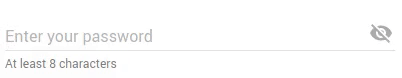

# material-ui-password-field
This project provides a [password field][passwordspec] for [Material-UI][mui].



If you want to try the component yourself instead of watching a gif, head over to [the storybook][gh-pages] for a live demo!

## Installation
```shell
npm i --save material-ui-password-field
```

## Usage
The usage of this component is pretty straightforward: Just replace your boring password `TextField`s with the shiny new `PasswordField` and you're done.

```jsx
import PasswordField from 'material-ui-password-field'

<PasswordField
  hintText="At least 8 characters"
  floatingLabelText="Enter your password"
  errorText="Your password is too short"
/>
```

## Properties
| Name | Type | Default | Description |
| --- | --- | --- | --- |
| buttonDisabled | `bool` | `false` | Set this to `true` to disable the visibility button. |
| classes | `object` | | Override or extend the styles applied to the component. |
| visible | `bool` | `false` | Set this to `true` to make the password initially visible. |

Additionally, all properties of Material UI's [Text Field][mui-text-field] should be supported, except for `type` and `multiLine`. Please open an issue if something is missing or does not work as expected.

## CSS
You can override all the class names thanks to the `classes` property. This property accepts the following keys:

| Name | Description |
| ---- | ----------- |
| `root` | Styles applied to the root element. |
| `input` | Styles applied to the `Input` element. |
| `iconButton` | Styles applied to the `IconButton` element. |
| `icon` | Styles applied to the `ToggleIcon` element. |

## Credits
Some code for the input component was adapted from Material UI's [Text Field][mui-text-field] that we all know and love.

## License
The files included in this repository are licensed under the MIT license.

[passwordspec]:https://material.google.com/components/text-fields.html#text-fields-password-input
[mui]: http://www.material-ui.com/#/
[mui-text-field]: http://www.material-ui.com/#/components/text-field
[gh-pages]: https://teamwertarbyte.github.io/material-ui-password-field/
